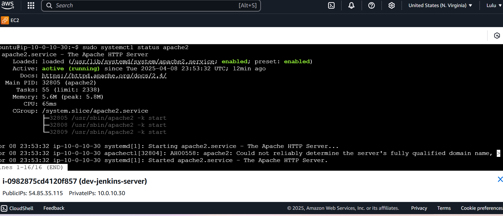

# terraform-apache-jenkins
a project to automate a jenkinsfile using terraform nd using the jenkins pipeline to install apache using terraform

on the project directory a folder infra was created with the below files inside it

backend.tf          jenkins-server.tf  provider.tf       variables.tf
jenkins-script.sh*  output.tf          terraform.tfvars  vpc.tf

on the project directory below is the files created

backend.tf  jenkinsfile  README.md   vpc.tf
ec2.tf  output.tf    terraform.tfvars
install-apache.sh  provider.tf  variable.tf

on the infra folder when running the terraform init the backend threw error which i resolved by deleting what was in the bucket using the below command

aws s3 rm s3://lulu-1985-bucket --recursive 
after which i re-run the terraform init
terraform fmt
terraform validate
terraform plan --auto-approve
terraform destroy --auto-approve

cd to the project directory and push to github

paste the public ip of the jenkins ec2 instance on the browser and start ur jenkins configurations

once inside jenkins you go to 
new item - pipeline - ok
Description - check github project - paste the project github url
pipeline - click the drop down and select pipeline script from scm
github path - jenkinsfile
Apply - save
build

NOTE : the first build will throw an error cause is not seeing your iam role

when throwing this error

[Pipeline] sh
+ terraform init
Initializing the backend...
╷
│ Error: No valid credential sources found
│ 
│ Please see https://www.terraform.io/docs/language/settings/backends/s3.html
│ for more information about providing credentials.
│ 
│ Error: failed to refresh cached credentials, no EC2 IMDS role found,
│ operation error ec2imds: GetMetadata, http response error StatusCode: 404,
│ request to EC2 IMDS failed
│ 
╵
[Pipeline] }
[Pipeline] // stage
[Pipeline] stage
[Pipeline] { (Terraform fmt stage)
Stage "Terraform fmt stage" skipped due to earlier failure(s)
[Pipeline] getContext
[Pipeline] }

This usually means Terraform is trying to access AWS but can’t authenticate, and it’s not running on an EC2 instance (or if it is, there's no IAM role assigned)

go ahead and create an iam role in ec2 instance
search for IAM - roles - create roles - aws service - service or use roles - select ec2 - next
Administrator access - next
role name(give the role a name - create)

Go back to ec2 - instance - check d instance - action -modify iam role - iam role - select the role created - update
go back to jenkins clck on configure u will c 
This project is parameterized go ahead and apply -save - build 

threw the below error after build

+ terraform validate
╷
│ Error: Reference to undeclared input variable
│ 
│   on provider.tf line 13, in provider "aws":
│   13:   region = var.region
│ 
│ An input variable with the name "region" has not been declared. This
│ variable can be declared with a variable "region" {} block.
╵
[Pipeline] }
[Pipeline] // stage
[Pipeline] stage
[Pipeline] { (Terraform plan stage)

i entered three errors during the build stage
1. my jenkins was in small letter while the one jenkins picked was in capital letter that threw an error of jenkins file path not seen.

2. IAM ROLE not added

3. i had a duplicate of the vpc.tf in variable.tf 

after  successfully building the apply parameter i clicked on the destroy action to run terraform destroy